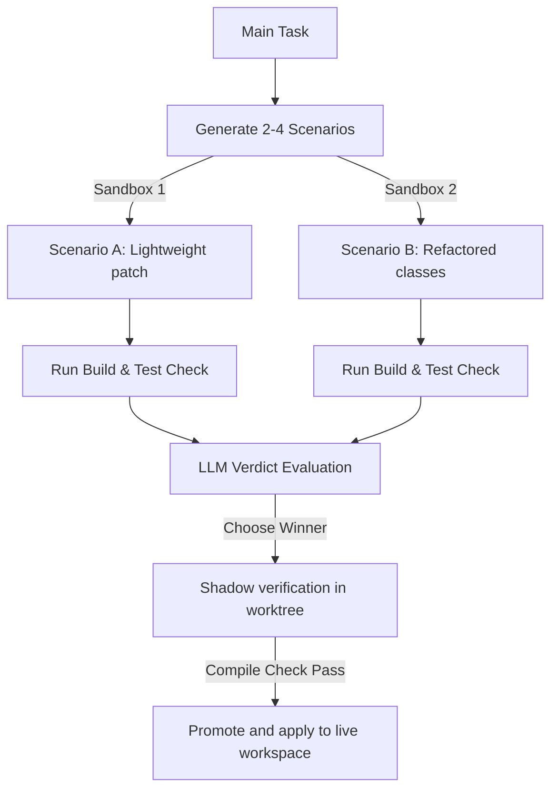

# Swades Agent v3.1: Complete Developer Walkthrough & Feature Guide

Swades Agent is an enterprise-grade, terminal-native autonomous coding agent designed to execute high-complexity software engineering tasks safely, cleanly, and efficiently. 

This document provides a hyper-detailed, step-by-step developer manual detailing the design patterns, mechanisms, and exact instructions on how to leverage 100% of the agent's capabilities.

---

## Table of Contents
1. [Core ReAct Agentic Loop](#1-core-react-agentic-loop)
2. [Dynamic Timing, Countdown & Urgency Pressure System](#2-dynamic-timing-countdown--urgency-pressure-system)
3. [Self-Healing Linter Auto-Fix & Indentation Rules](#3-self-healing-linter-auto-fix--indentation-rules)
4. [Persistent Shell Layer, Detached Timeout & Peek Terminal](#4-persistent-shell-layer-detached-timeout--peek-terminal)
5. [24/7 Autonomous Director Mode](#5-247-autonomous-director-mode)
6. [GUI Computer Use Agent (CUA) Mode & Click Guardrails](#6-gui-computer-use-agent-cua-mode--click-guardrails)
7. [Isolated Parallel Subagents & Git Worktrees](#7-isolated-parallel-subagents--git-worktrees)
8. [Multi-Scenario Sandbox Simulation Engine](#8-multi-scenario-sandbox-simulation-engine)

---

## 1. Core ReAct Agentic Loop

The foundational engine of Swades Agent operates on the **ReAct (Reasoning + Acting)** loop pattern. 

### How It Works
1. **Thought Phase**: The agent prints `💭 [Reasoning]` as it outlines its plan, breaks down the user request, and selects the next logical action.
2. **Act Phase**: The agent invokes one of its registered tools (such as reading a file, patching, or running a shell command).
3. **Observe Phase**: The environment returns the tool's execution output to the agent.
4. **Iterate**: The loop repeats until the agent outputs a direct final text response to the user instead of a tool call.

### Best Practices for Prompts
To get the best performance from the ReAct loop:
- Be descriptive about your goal: specify paths, compilation frameworks, and target test cases.
- Let the agent index the codebase: always run `index_codebase` at the start to create `.agent_index.json`. This provides structural knowledge without consuming excessive tokens.

---

## 2. Dynamic Timing, Countdown & Urgency Pressure System

Swades Agent v3.1 features a timing pressure manager that forces the agent to behave like a human engineer working against a clock. This curbs LLM "hallucination loops" and keeps execution efficient.

### The Estimation Phase
When you launch a task, Swades Agent executes a fast, isolated LLM call to analyze your prompt and estimate the optimal time budget (in seconds) required to solve the task.
- For a simple file save: the AI allocates ~60–90 seconds.
- For refactoring multiple folders: the AI allocates ~300–600 seconds.

### The Urgency Countdown
At every single execution step, the system calculates the remaining time and displays a colored, visual progress bar:
```
⏰ TIMER: 145s remaining / 180s [████████████░░░░░░] URGENCY: CALM
```
The manager updates the agent's system instructions (`messages[0].content`) at each step, injecting current timing statistics and changing the agent's "psychological" state:
- **CALM** (> 60% remaining): *"Plenty of time left. Focus on clean code, thorough validation, and complete solutions."*
- **MEDIUM** (30% to 60% remaining): *"Time is ticking. Work efficiently, run build checks, and minimize redundant steps."*
- **URGENT** (10% to 30% remaining): *"Time is running low! Avoid long round-trips, focus strictly on core requirements."*
- **PANIC** (< 10% remaining): *"⚠️ CRITICAL TIME PRESSURE: Time is almost up! Omit extra exploratory commands and finish the task immediately."*
- **OVERTIME** (≤ 0s remaining): *"🚨 DEADLINE EXPIRED: You are running in OVERTIME! You MUST wrap up immediately or request an extension."*

### Loop Prevention & Grace Limits
If the timer runs out, the agent enters **OVERTIME**. To prevent infinite execution loops (where the agent tries the same failed edit repeatedly), the system grants a strict **grace limit of 3 steps**. If the agent fails to finish the task or extend the deadline within 3 steps of overtime, the manager triggers a forced loop-prevention termination.

### How to Extend the Deadline
The agent can dynamically call the `extend_deadline` tool to add time to its budget:
```json
{
  "name": "extend_deadline",
  "arguments": {
    "additional_seconds": 120,
    "reason": "Encountered missing test dependencies in package.json requiring installation"
  }
}
```
This resets the timers and returns the agent to a lower urgency level.

---

## 3. Self-Healing Linter Auto-Fix & Indentation Rules

Save files and code patches are validated at write-time, preventing compilation and runtime breaks.

### Smart Auto-Fix Routines
If a write or patch tool returns a syntax validation failure, Swades Agent runs a series of recovery handlers on the file buffer:
1. **Bracket Recovery Stack**: The linter parses syntax nesting (`{}`, `()`, `[]`). If unclosed brackets are found (e.g. the agent forgot a closing brace at the end of a patch block), it appends the matching closing brackets to save the syntax.
2. **JSON Normalizer**: Strips illegal trailing commas, wraps unquoted keys in double quotes, and converts single quotes to double quotes, making JSON parseable.
3. **Indentation Re-aligner**: Scans the file to detect the dominant indentation (spaces vs tabs) and automatically formats lines consistently.

If the auto-fix resolves the error, the linter writes the corrected content back to disk, re-runs verification, and informs the agent: `✅ File written and automatically auto-fixed syntax errors.`

### Conditional Indentation Warnings
To avoid flooding logs with cosmetic warnings:
- Warnings regarding indentation jumps or mixed spaces/tabs are bypassed for non-indentation-sensitive files (like `.js`, `.json`, `.css`, `.html`, `.md`, `.env`).
- Strict indentation checks remain fully active for indentation-sensitive formats: Python (`.py`) and YAML (`.yml`, `.yaml`).

---

## 4. Persistent Shell Layer, Detached Timeout & Peek Terminal

Standard agents block your terminal when running commands. If a command runs too long, they kill it. Swades Agent handles this using an asynchronous shell multiplexer.

### detached Execution
When you run a command using `run_command`, the agent spawns the task in a detached shell process. 
- The process stdout and stderr are piped continuously to `.agent_terminal.log` in the workspace.
- The manager waits up to 30 seconds. If the command finishes, it returns the output.
- If the command takes longer than 30 seconds, the agent **does not kill it**. It detaches, returns a timeout warning, and lets the command run in the background.

### Peeking the Buffer
If a command is running in the background (e.g., a dev server, a test suit, or a compile step), the agent (or you) can use the `peek_terminal` tool:
- **`peek` action (default)**: Reads the tail of `.agent_terminal.log` and reports whether the process is `[STATUS: RUNNING]` or `[STATUS: COMPLETED]`, showing the accumulated logs.
- **`kill` action**: Sends a termination signal to clean up the process group and prevent zombie shells.

### How to use it
If you are running a compilation that takes 45 seconds, the agent will timeout at 30 seconds:
1. Step 1: Agent calls `run_command` -> Times out and detaches.
2. Step 2: Agent thinks: *"The build is compiling in the background. I will call peek_terminal to check on it."*
3. Step 3: Agent calls `peek_terminal` -> Output shows compilation in progress.
4. Step 4: Agent waits or peeks again until status is `COMPLETED` and reads success logs.

---

## 5. 24/7 Autonomous Director Mode

For complex features requiring multiple test/implementation cycles, Swades Agent has a supervisor loop.

### How to Run It
Pass the `-a` or `--autonomous` flag:
```bash
node src/index.js "Implement a database caching layer and verify it passes performance tests" --autonomous
```

### The Director Loop
1. The **Worker Agent** runs to resolve the initial task.
2. Once the worker exits, a supervising **Director LLM** reviews the full session history and terminal output.
3. The Director determines:
   - If the task is completed: returns `STATUS: COMPLETE` and stops.
   - If bugs, missing tests, or issues remain: the Director writes the next specific subtask prompt on behalf of the user, pushes it into the worker's history, and triggers the next cycle.

---

## 6. GUI Computer Use Agent (CUA) Mode & Click Guardrails

Swades Agent features native GUI automation for desktop and web browser control, running natively on GNOME Wayland and X11 configurations.

### Running CUA
Activate CUA mode via the `-c` or `--cua` flags:
```bash
node src/index.js "Open Chrome, search for Node.js release notes, and copy the version table" --cua
```
CUA mode connects to GNOME Mutter remote desktop and screencast D-Bus session portals, capturing screens, tracking mouse coordinates via `.mouse_position.json`, and simulating inputs.

### Bounding-Box Proximity & Click Protection
To prevent the model from getting stuck clicking the same dead GUI coordinates endlessly:
1. **Bounding Box Proximity**: Clicks are mapped. Clicks falling within a **25px horizontal and 15px vertical bounding box** of a previous click are flagged.
2. **Consecutive Block**: The model is forbidden from clicking the same coordinate area back-to-back.
3. **Frequency Cap**: The model cannot click the same area more than **2 times overall** in a single execution. Clicks exceeding this limit are blocked, forcing the agent to find alternative paths.

---

## 7. Isolated Parallel Subagents & Git Worktrees

When a task is classified as high-complexity, the parent orchestrator breaks down the work into 2 to 5 concurrent subtasks.

### Isolated Workspaces
- The orchestrator spins up separate git worktree folders under `.swades_worktrees/`.
- Each subagent runs concurrently in its own worktree workspace. This ensures **zero risk of file corruption or dirty edits** during development.
- When finished, code diffs are merged back into your active workspace. Any overlapping conflict is resolved dynamically by a specialized merge-resolution subagent.

---

## 8. Multi-Scenario Sandbox Simulation Engine

Before any change is committed to your real workspace files, Swades Agent tests different code design alternatives in sandbox directories under `.swades_sandboxes/`.

### The Simulation Pipeline


1. **Generation**: The simulator generates alternative implementation scenarios (e.g. Class inheritance vs. Functional pattern).
2. **Execution**: Scenarios are checked inside sandboxes, executing test files and builds.
3. **Verdict**: The LLM reviews sandbox results and selects the clean, compilation-passing winner.
4. **Promotion**: The winning diff is checked in a shadow worktree and promoted to the live workspace.

By combining sandboxed scenarios, self-healing linters, persistent background terminal monitors, and deadline pressure managers, Swades Agent v3.1 provides the most robust, resilient, and safe developer experience available in your terminal.
